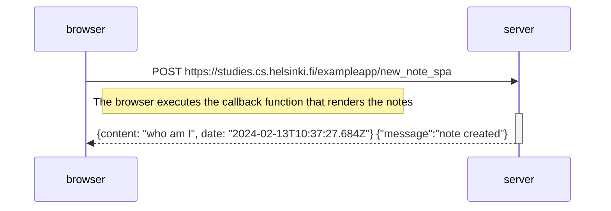

```mermaid
sequenceDiagram
    participant browser
    participant server

    browser->>server: POST https://studies.cs.helsinki.fi/exampleapp/new_note_spa
Note right of browser: The browser executes the callback function that renders the notes
    activate server
    server-->>browser: {content: "who am I", date: "2024-02-13T10:37:27.684Z"} {"message":"note created"}
    deactivate server
```
